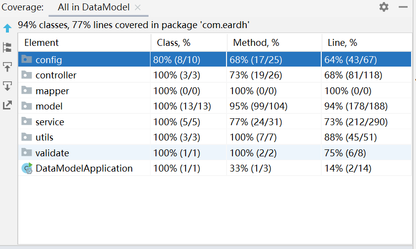
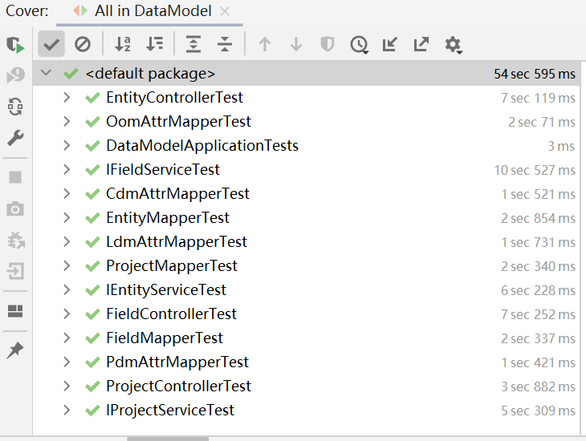
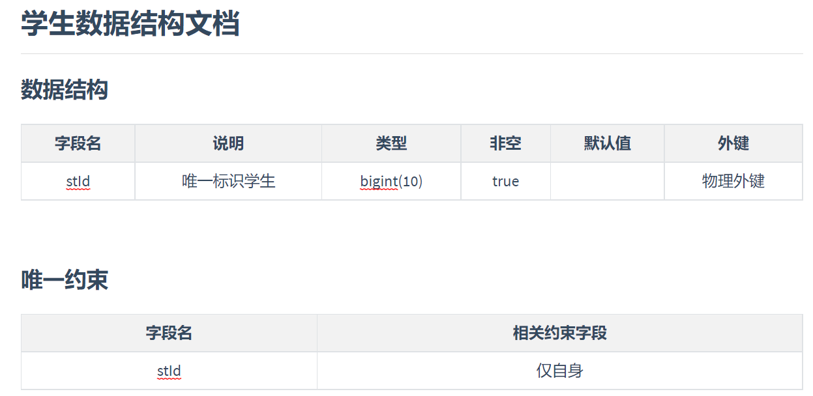
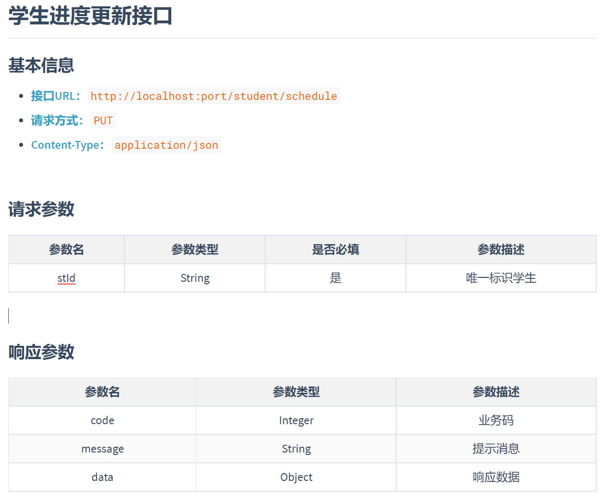

## 项目总结报告

### 1. 报告信息

<div>
    <table style="width:61.8%">
        <tr>
            <td>项目名称</td>
            <td>数据建模系统</td>
        </tr>
        <tr>
            <td>项目报告人</td>
            <td>黄磊</td>
        </tr>
        <tr>
            <td>负责模块</td>
            <td>后端</td>
        </tr>
        <tr>
            <td>日期</td>
            <td>2022/6/30</td>
        </tr>
    </table>
</div>


### 2. 项目背景与要求

#### 1. 背景

实现系统CDM（概念数据模型）、LDM（逻辑数据模型）、PDM（物理数据模型）、OOM（面向对象模型）四种模型设计功能。

- 减少数据重复提用；
- 简化数据建模流程；
- 提高工作与交流效率；
- 保证数据模型和项目实施一致性；
- 为下一步自动化文档转换和代码打下基础。


#### 2. 目标和需求

通过客户输入的各种模型属性信息，完成对字段属性的综合建立数据模型，生成接口文档和数据结构文档提供给客户端查阅。


#### 3. 项目方案

采用前后后端分离的方案，后端采用springboot和mybatis-plus框架、前端采用react框架技术，前端提交给后端数据统一采用json数据格式，后端响应前端数据格式统一为：

```json
// 响应体结构格式
{
    "code": "",    // 业务码（响应码）
    "message": "", // 消息提示
    "data": ""     // 数据主体
}
```

`code`采用枚举实现，`message`则是可能通知前端提示的一些错误信息，`data`作为数据的载体，里面封装真正返回给客户端的数据信息，统一解析为json格式返回给客户端。


### 3. 项目总结

#### 1. 进度方面

项目的开发周期：


从进度上分析，后端时间安排紧跟项目，其中，需求分析阶段耗费大量时间，同时由于此阶段分析不完善不准确的原因，后面几个阶段均受到影响，这也是我第一个以软件开发周期步骤顺序进行的项目，由于系统概念不够完善，所以后期牵连链太长。


#### 2. 单元测试方面

后端开发过程中，我考虑了可能出现的一些情况，并为代码设计了覆盖的单元测试方案，总体感觉代码覆盖率如下：



单元测试的通过率：




#### 3. 沟通交流方面

在本项目中，由于前期意见不统一，对需求分析和理解出现歪曲，在数据模型设计和功能菜单方面也出现不必要的障碍，归结到底，还是需求分析不够明确理解。

在沟通交流方面，我尽可能的主动和导师联系，并尽可能理解需求，但是需求过于抽象，所以说实话，我也只是理解了个大概，所以在数据结构设计方面可能会有所纰漏，而且结构字段可能不够完善，因此后面部分功能可能无法实现，再一次说明需求分析的重要性。


#### 4. 技术与方法评价

以SpringBoot框架为基础Web架构，整合mybatis-plus和第三方其他技术；

- 基于阿里druid连接池，并实现对sql操作的监控。

- 基于SpringBoot自带的校验框架，实现数据格式的正则等校验方式，同时实现分组校验，自定义校验注解的功能。

- 基于SpringBoot整合的测试框架完成项目代码的测试。

- 整合开源项目`Java-Markdown-Generator`，实现动态生成数据结构文档和接口文档，这两种文档的样式如图：

  > **数据结构文档**

  

  > **接口文档**

  

- 基于SpringBoot的任务调度机制，实现定时器功能，定期清除由于客户端调用生成的文档文件，提高系统的高效运行性。

后面遇到的一个问题是关于打包以后文件的保存路径设置，由于Windows操作系统和Linux操作系统在底层文件系统实现的操作上存在差异，所以造成打包前和打包后零时文件存储路径报错和异常，并且同时为了兼容测试，所以在设计上构造了两个用户，其中一个用于运行测试，而另外则在生产环境下有效，避免可能测试和运行冲突问题，基于`ApplicationHome`来兼容了两种不同的系统临时存储目录。


#### 5. 经验教训

由于这是我经历的第一个严格遵循软件开发流程而进行的项目，与过去直接编码形成鲜明的对比，需求分析在项目开发中占据一个部分，真正的理解需求和挖掘需求至关重要，否则后期开发改动过大，但是我觉得在需求真的没有搞懂的情况下，可以基于原型模型开发，即在理解基本需求的基础上，开发一个功能不完善系统，后期再对系统不断迭代更新，但这也要建立再对需求的正确理解上，否则改动可能会很大。

同时，团队之间的沟通固然也是重要的，否则可能会出现各干各的，最后无法整合的情况，而这同样也来自对功能菜单的严格设计，所以前期在功能菜单的设计方面我也不是很理解到底做啥，到底干啥等问题，同时也是自己理解能力不足的原因所致吧。

最后实在也没办法，毕竟需求设计的缺陷确实太大，最后部分功能也没法实现，所以对无法实现的功能进行了裁剪删除。

同时感谢各位导师两个月以来的耐心指导，要是没有您们我估计我基本的那些都不明白，非常感谢！！


